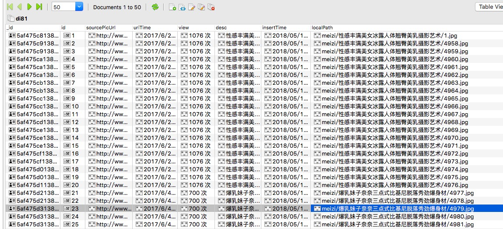
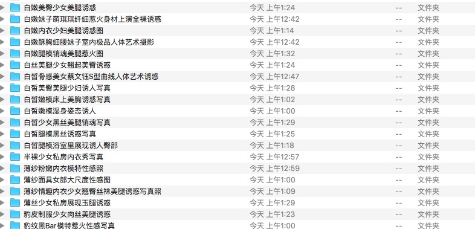
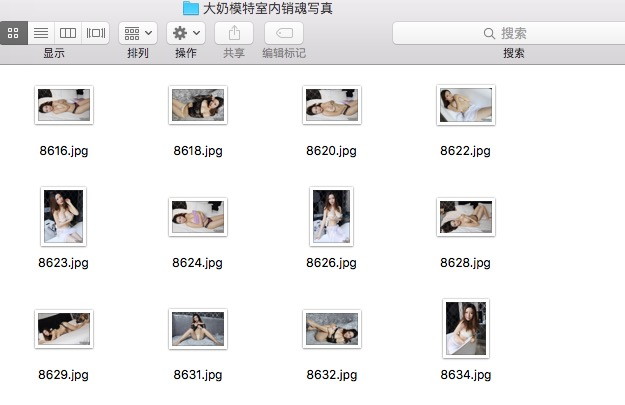

# 利用python爬取一些网站的妹子图片

本项目主要用于一些网站的妹子图片爬取，利用工厂模式编写，方便日后扩展。目前为初级版本，目前仅仅可以爬取 [di81美女网](http://di81.com/) 的图片，还有许多需要改进的地方，如免费代理模块未做可扩展处理、mongoDb安全性处理模块。该小项目会不定时更新，欢迎star
详细介绍，请看我的博客：https://blog.csdn.net/linhai1028/article/details/80280674

------

## 模块简介

httpProxy.py 模块爬取网络上的免费代理ip网站，并验证可用后入库，而后进行实时验证。

crawBase以及其他craw*模块 可理解为工厂模式中的产品模块，主要利用requests做请求，lxml做页面分析。

log.py 做日志输出处理。

xmFactory.py 工厂模式中的工厂模块。

xmCustomer.py 工厂模式中的客户模块。

mongodb主要负责数据库的链接，切换到表明，以及数据库的插入操作，其他操作暂时没有封装。

## 结果展示

1.数据库展示



2.图片展示




## 使用

安装相关的依赖包，依赖包需求见文末的环境部分
在mongoDb.py处配置数据库用户名和密码后，就可以运行代码了
```
python xmCustomer.py
```

-----

## 环境
1. python3.6
2. requests2.18
3. mongodb2.6
4. pymongo3.6
5. lxml4.2


